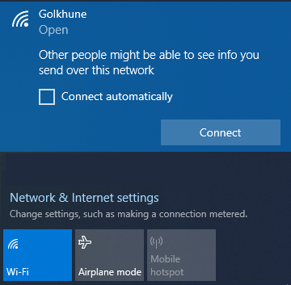
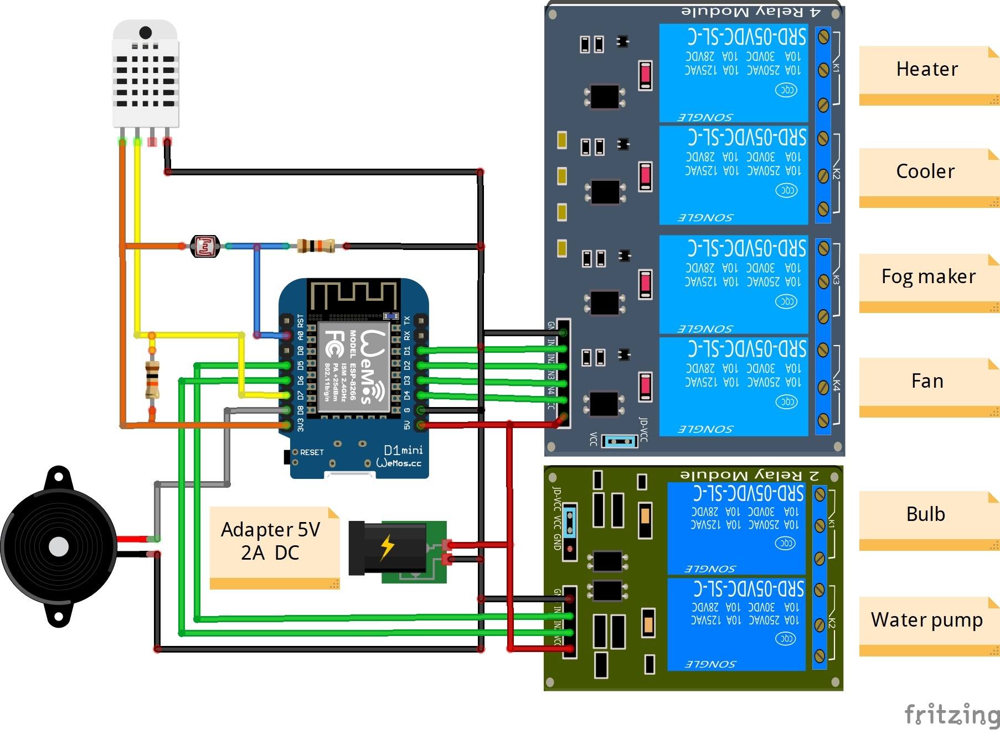
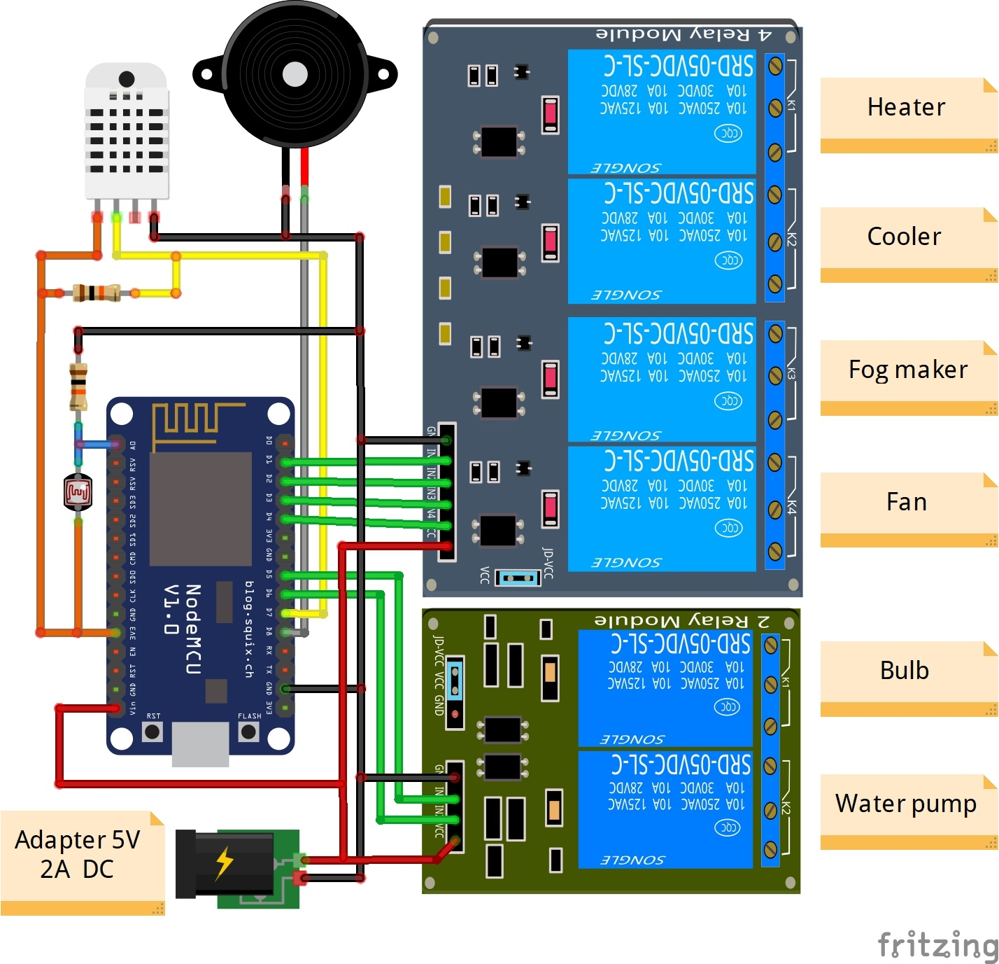
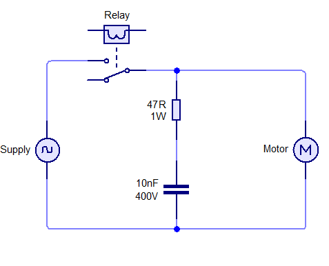

    

## Description:
This middleware can automatically control the temperature and humidity of the greenhouse using the **DHT22** sensor, you will also be able to check the amount of light inside the greenhouse and control the lighting and water pump with your phone. You can install it on the **Nodemcu** and **Wemos D1** development board and easily manage your greenhouse with the least necessary equipment.

## How to use:
1-Download the latest version of the middleware from the [releases](https://github.com/alireza-moshfeghi/Golkhune_ESP8266/releases) section.

2-Install the **CH341** driver on your system from [here](https://github.com/alireza-moshfeghi/Golkhune_ESP8266/blob/main/CH341SER.zip).

3-Download and run the **ESP8266 Flasher** program from [here](https://github.com/alireza-moshfeghi/Golkhune_ESP8266/blob/main/ESP8266Flasher.zip).

4-Enter the middleware binary file from the **config** tab.

5-Connect your development board to the system and click on the **start** button from the **operation** tab.

6-After middleware the firmware on the module, the **Golkhune** access point will appear in the list of wireless networks in your system, connect to it.

7-Open your web browser and type the address **192.168.4.1** in the address bar to enter the middleware panel.

> **Note:** To edit the open source project, be sure to download the required libraries from [here](https://github.com/alireza-moshfeghi/Golkhune_ESP8266/tree/main/libraries) and install them on Arduino IDE.

## How to connect:
Wemos D1 mini:

NodeMCU:

> **Note:** For consumers with coils such as motors, it is better to use a snubber circuit to prevent induced voltage.

## Necessary equipment:
- Wemos D1 or Nodemcu development board
- DHT22 temperature and humidity sensor
- 4-channel and 2-channel relay module
- Photocell light resistor
- 4.7kΩ and 10kΩ resistor
- Breadboard jumper wire

